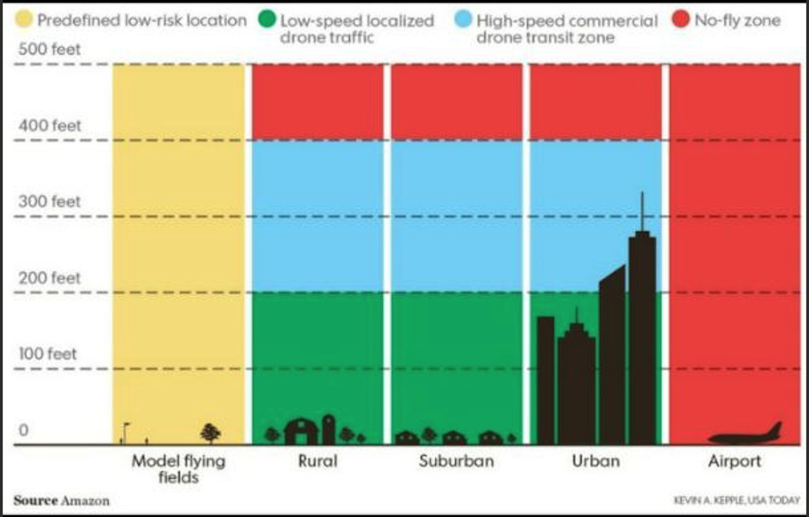
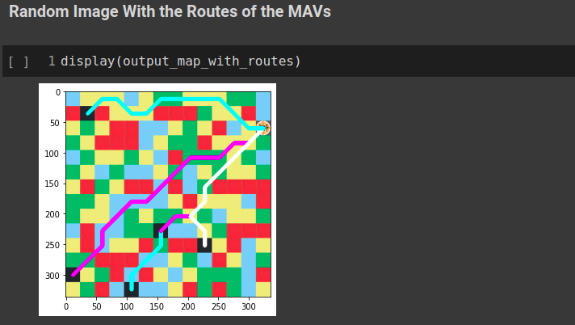

# Final_DroneDeliveryScheduler

Flight Zones

The first part of the algorithm is responsible for defining the best path between the starting point and the place of delivery according to the zones described above.

The second part decides the best combination of deliveries that will be made by the drones. It takes into account the availability of drones at the moment, the total flight time of each drone (in pixels), the time of each delivery (generated by the first part) and the revenue generated by each delivery. So the final goal is to find the combination of flights that maximizes revenue according to the variables mentioned, respecting the flight zones.

**List Number**: X 
**Discipline Subject**: Final Project 

## Students
|Number | Student |
| -- | -- |
| 17/0146251  |  João Lucas Zarbiélli |
| 19/0046945  |  Leonardo Michalski Miranda |

## Screenshot

## Video (pt-br, [download link]())

## How to run
**Language**: Python  
**Frameworks**: Jupyter; NumPy.
Access the [notebook]() with Google Colab.

## References

